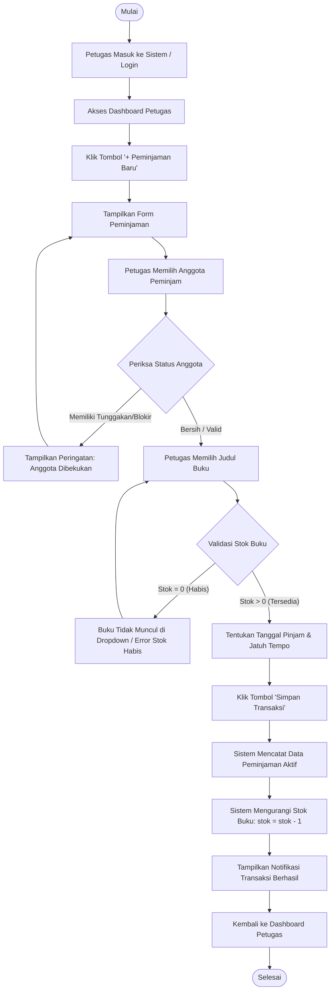
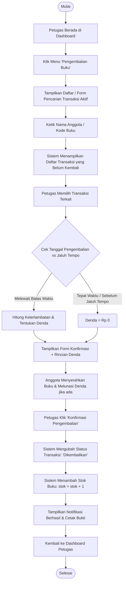
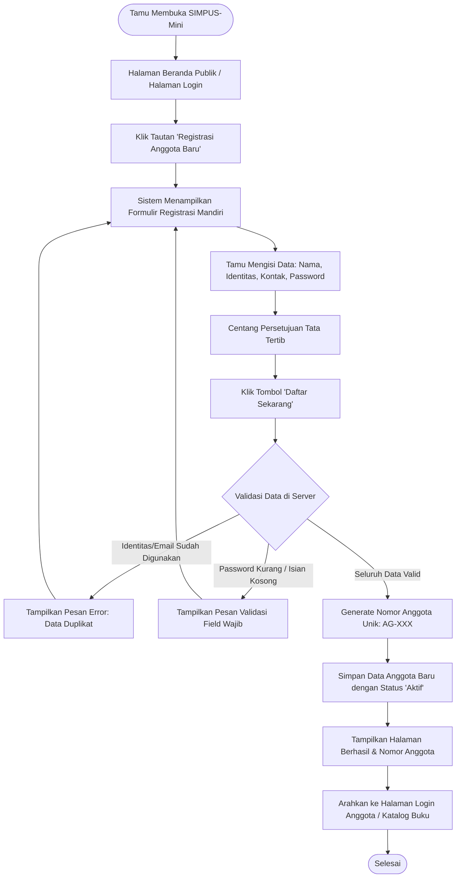
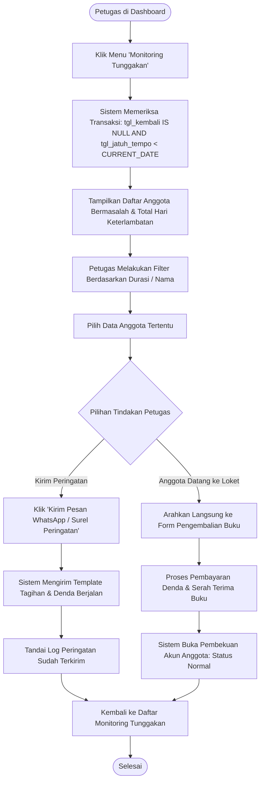

# Dokumentasi Perancangan UI/UX: Wireframe & User Flow SIMPUS-Mini

---

## 1. Konsep Dasar UI/UX Design

### 1.1 Apa Beda UI dan UX?
Meskipun sering diucapkan bersamaan, **UI (User Interface)** dan **UX (User Experience)** memiliki fokus dan tanggung jawab yang berbeda dalam rekayasa perangkat lunak web:

| Aspek | User Interface (UI) | User Experience (UX) |
| :--- | :--- | :--- |
| **Kepanjangan** | *User Interface* (Antarmuka Pengguna) | *User Experience* (Pengalaman Pengguna) |
| **Fokus Utama** | Estetika visual: pemilihan warna aksen, tipografi, tata letak, tombol, dan jarak (*spacing*). | Alur, kemudahan, dan efisiensi: apakah pengguna dapat mencapai tujuannya tanpa kebingungan atau hambatan (*friction*). |
| **Penerapan di SIMPUS-Mini** | Berkas `assets/css/style.css` (tema warna `#1d5b8a`, kartu berbayang, tata letak form, dan tabel bergaya *zebra*). | Urutan langkah pengisian form, pembatasan stok buku habis, pemisahan otorisasi tamu vs petugas, dan navigasi transaksi. |

> **Analogi Sederhana:**  
> Jika sebuah aplikasi diibaratkan sebuah perpustakaan fisik:
> * **UI** adalah desain arsitektur gedung, warna cat dinding rak buku, tata letak etalase, dan kerapian papan petunjuk.
> * **UX** adalah kemudahan pengunjung dalam menemukan buku yang dicari, kelancaran proses peminjaman di meja sirkulasi, hingga ketiadaan antrean yang membingungkan pengunjung saat membayar denda atau mengembalikan buku.

---

### 1.2 Kenapa Merancang Dulu Sebelum Menulis Kode?
Membangun antarmuka langsung dengan kode HTML/CSS tanpa perencanaan tertulis sering kali memicu masalah besar:
1. **Mencegah Hilangnya Logika/Kondisi Kritis:** Menulis kode form peminjaman secara tergesa-gesa rentan melupakan aturan bisnis penting, misalnya *"apakah buku dengan stok 0 masih bisa dipilih?"* atau *"apa yang terjadi jika anggota masih memiliki tunggakan?"*.
2. **Efisiensi Waktu & Biaya Revisi (*Cheaper to Iterate*):** Mengubah satu baris sketsa teks atau satu kotak pada user flow jauh lebih mudah dan cepat dibandingkan membongkar baris kode HTML, logika CSS, dan skrip JavaScript yang sudah terlanjur dibuat.
3. **Peta Acuan (*Blueprint*) yang Jelas:** Wireframe dan user flow menjadi panduan bagi pengembang selama tahapan implementasi bertahap (mulai dari Jobsheet 5 hingga Jobsheet 12).

---

### 1.3 Dua Alat Bantu Rancangan: Wireframe & User Flow
Dokumentasi ini mencakup dua instrumen utama yang saling melengkapi:
* **Wireframe:** Sketsa kasar berorientasi struktur (*low-fidelity blueprint*) yang menjawab pertanyaan: *"Elemen apa saja yang ada di halaman ini dan di mana posisinya?"*.
* **User Flow:** Diagram langkah terurut yang menjawab pertanyaan: *"Bagaimana alur perjalanan pengguna melintasi beberapa halaman/aksi untuk menuntaskan suatu proses bisnis?"*.

---

## 2. Standar Konvensi Simbol Wireframe (ASCII Art)

Wireframe dalam dokumen ini dirancang menggunakan konvensi karakter teks biasa (ASCII Art) dalam blok kode Markdown agar ringan, fleksibel, mudah direvisi, dan terintegrasi langsung dengan repositori proyek.

| Simbol ASCII | Representasi Antarmuka | Padanan Elemen Semantik HTML5 |
| :--- | :--- | :--- |
| `+---+` / `\|` / `---` | Batas kontainer, bingkai luar kartu, atau garis tabel | `<main>`, `<section>`, `<article>`, `<table>` |
| `[______________]` | Kolom isian teks pendek / sandi | `<input type="text">` atau `<input type="password">` |
| `[v ____________]` | Dropdown menu pilihan | `<select>` dan `<option>` |
| `[ Teks Tombol ]` | Tombol aksi yang dapat diklik | `<button type="submit">` atau `<button type="button">` |
| `(o) Pilihan` / `( )` | Radio button (pilihan tunggal) | `<input type="radio">` |
| `[x] Pilihan` / `[ ]` | Kotak centang (opsi jamak) | `<input type="checkbox">` |
| Teks tanpa tanda kurung | Teks statis, judul, atau label kolom | `<h1>`, `<h2>`, `<p>`, `<label>`, `<th>` |

Wireframe sengaja disajikan dalam wujud *low-fidelity* (tanpa warna grafis khusus) agar fokus evaluasi tertuju pada struktur informasi dan kegunaan hierarki tanpa teralihkan oleh selera visual warna primer/sekunder.

---

## 3. Definisi Aktor & Matriks Hak Akses (Otorisasi)

SIMPUS-Mini membagi pengguna ke dalam 2 kelompok peran (*actor*):

```
                       +-------------------------+
                       | Pengguna SIMPUS-Mini    |
                       +-------------------------+
                                    |
            +-----------------------+-----------------------+
            |                                               |
            v                                               v
    [ Aktor: Tamu (Guest) ]                     [ Aktor: Petugas (Staff) ]
    * Tanpa login                               * Wajib login & autentikasi
    * Akses publik                              * Akses transaksi & CRUD
    * Jelajah katalog & registrasi              * Pengelolaan operasional penuh
```

### 3.1 Profil Aktor
1. **Tamu (Guest / Publik):**  
   Pengguna umum tanpa akun atau belum masuk ke sistem. Tamu hanya memiliki hak baca (*read-only*) terhadap katalog publik dan hak mendaftarkan diri secara mandiri sebagai calon anggota.
2. **Petugas (Staff Perpustakaan):**  
   Pengguna terotorisasi yang bertanggung jawab atas operasional sirkulasi perpustakaan. Memerlukan autentikasi melalui form login untuk mengakses dashboard, manajemen buku/anggota, serta transaksi peminjaman dan pengembalian.

### 3.2 Matriks Hak Akses (Authorization Matrix)

| Fitur / Halaman | Tamu (Guest) | Petugas (Staff) | Keterangan Otorisasi |
| :--- | :---: | :---: | :--- |
| **Beranda Publik (`index.html`)** | Ya | Ya | Dapat diakses bebas oleh semua aktor |
| **Katalog Buku Publik (`buku/list.html`)** | Ya | Ya | Hanya menampilkan informasi stok & detail |
| **Registrasi Mandiri Anggota** | Ya | Ya | Formulir publik bagi calon anggota baru |
| **Halaman Login Petugas** | Ya | Ya | Pintu masuk verifikasi kredensial Petugas |
| **Dashboard Petugas** | Tidak | Ya | Dialihkan (*redirect*) ke Login jika belum autentikasi |
| **Tambah / Edit / Hapus Buku** | Tidak | Ya | Fitur CRUD master buku khusus Petugas |
| **Tambah / Edit / Hapus Anggota** | Tidak | Ya | Fitur CRUD master anggota khusus Petugas |
| **Form Transaksi Peminjaman Baru** | Tidak | Ya | Sirkulasi peminjaman oleh Petugas |
| **Form Transaksi Pengembalian** | Tidak | Ya | Sirkulasi pengembalian & denda oleh Petugas |
| **Riwayat Transaksi & Tunggakan** | Tidak | Ya | Laporan dan pemantauan status sirkulasi |

---

## 4. Wireframe Antarmuka Sistem

Berikut adalah rancangan wireframe ASCII untuk setiap antarmuka utama SIMPUS-Mini, baik wireframe bawaan Jobsheet 4 maupun wireframe baru hasil latihan.

### 4.1 Wireframe Halaman Login Petugas (Jobsheet 4 §2.1)
Digunakan oleh Petugas untuk membuktikan identitas sebelum dapat mengakses data sirkulasi perpustakaan.

```text
+-------------------------------------------------------------------+
|                           SIMPUS-Mini                             |
|-------------------------------------------------------------------|
|                                                                   |
|                        [ Login Petugas ]                          |
|                                                                   |
|         Username : [________________________]                     |
|         Password : [________________________]                     |
|                                                                   |
|                      [      Masuk      ]                          |
|                                                                   |
|                 Belum punya akun? Registrasi di sini              |
|                     Kembali ke [ Beranda Publik ]                 |
|                                                                   |
+-------------------------------------------------------------------+
|            (c) 2026 SIMPUS-Mini -- Sistem Perpustakaan            |
+-------------------------------------------------------------------+
```

---

### 4.2 Wireframe Dashboard Petugas (Jobsheet 4 §2.3)
Tampilan pusat kendali operasional setelah Petugas berhasil melakukan autentikasi login.

```text
+------------------------------------------------------------------------------------+
| SIMPUS-Mini   Beranda | Buku | Anggota | Peminjaman | Riwayat | (Budi Santoso) [Logout]|
|------------------------------------------------------------------------------------|
|                                                                                    |
| Ringkasan Perpustakaan:                                                            |
| +--------------------+  +--------------------+  +--------------------+             |
| | Total Buku         |  | Total Anggota      |  | Sedang Dipinjam    |             |
| |       12           |  |        8           |  |        3           |             |
| +--------------------+  +--------------------+  +--------------------+             |
|                                                                                    |
| Aksi Cepat:                                                                        |
| [ + Peminjaman Baru ]     [ + Pengembalian Buku ]     [ Monitoring Tunggakan ]     |
|                                                                                    |
| Transaksi Terbaru:                                                                 |
| +--------------------------------------------------------------------------------+ |
| | Anggota        | Judul Buku          | Tgl Pinjam | Jatuh Tempo | Status       | |
| |----------------+---------------------+------------+-------------+--------------| |
| | Ahmad Fauzi    | Laskar Pelangi      | 2026-09-01 | 2026-09-08  | Dipinjam     | |
| | Siti Rahma     | Filosofi Teras      | 2026-09-03 | 2026-09-10  | Dipinjam     | |
| | Doni Pratama   | Laut Bercerita      | 2026-08-20 | 2026-08-27  | Terlambat    | |
| +--------------------------------------------------------------------------------+ |
|                                                                                    |
+------------------------------------------------------------------------------------+
|                     (c) 2026 SIMPUS-Mini -- Panel Petugas                          |
+------------------------------------------------------------------------------------+
```

---

### 4.3 Wireframe Form Peminjaman Buku Baru (Jobsheet 4 §3.2 & §3.4)
Formulir pencatatan transaksi peminjaman buku oleh Petugas (model satu buku per transaksi).

```text
+------------------------------------------------------------------------------------+
| SIMPUS-Mini   Beranda | Buku | Anggota | Peminjaman | Riwayat | (Budi Santoso) [Logout]|
|------------------------------------------------------------------------------------|
|                                                                                    |
| [ Form Peminjaman Buku ]                                                           |
| Catatan: Isikan data peminjaman dengan teliti. Buku yang stoknya 0 tidak muncul.   |
|                                                                                    |
| Pilih Anggota  : [v (AG-001) Ahmad Fauzi ________________________________________] |
| Pilih Buku     : [v (BK-003) Filosofi Teras -- Stok Tersedia: 4 _________________] |
| Tanggal Pinjam : [ 2026-09-09 ]                                                    |
| Durasi Pinjam  : [v 7 Hari (Jatuh tempo: 2026-09-16) ____________________________] |
| Catatan Khusus : [_______________________________________________________________] |
|                                                                                    |
|              [ Simpan Transaksi Peminjaman ]       [ Batal ]                       |
|                                                                                    |
+------------------------------------------------------------------------------------+
|                     (c) 2026 SIMPUS-Mini -- Panel Petugas                          |
+------------------------------------------------------------------------------------+
```

---

### 4.4 Wireframe Form / Halaman Pengembalian Buku (Jobsheet 4 §3.3)
Antarmuka untuk mencari transaksi yang sedang aktif dan memproses pengembalian buku beserta kalkulasi denda jika terjadi keterlambatan.

```text
+------------------------------------------------------------------------------------+
| SIMPUS-Mini   Beranda | Buku | Anggota | Peminjaman | Riwayat | (Budi Santoso) [Logout]|
|------------------------------------------------------------------------------------|
|                                                                                    |
| [ Pengembalian Buku ]                                                              |
| Cari Transaksi Aktif : [ Ketik Nama Anggota / Kode Buku / ID Transaksi ]  [ Cari ] |
|                                                                                    |
| Daftar Peminjaman Aktif:                                                           |
| +--------------------------------------------------------------------------------+ |
| | ID  | Anggota      | Buku Dipinjam  | Tgl Pinjam | Jatuh Tempo | Status | Aksi     | |
| |-----+--------------+----------------+------------+-------------+--------+----------| |
| | T01 | Ahmad Fauzi  | Laskar Pelangi | 2026-09-01 | 2026-09-08  | Telat  | [Pilih]  | |
| | T02 | Siti Rahma   | Filosofi Teras | 2026-09-05 | 2026-09-12  | Aktif  | [Pilih]  | |
| +--------------------------------------------------------------------------------+ |
|                                                                                    |
| Rincian Pengembalian Terpilih:                                                     |
| Peminjam           : Ahmad Fauzi (AG-001)                                          |
| Buku               : Laskar Pelangi (BK-001)                                       |
| Tanggal Pengembalian: [ 2026-09-09 ]                                               |
| Keterlambatan      : 1 Hari                                                        |
| Denda Keterlambatan: Rp 1.000 (Tarif: Rp 1.000 / hari)                             |
| Kondisi Buku       : [v Baik / Lengkap __________________________________________] |
|                                                                                    |
|             [ Konfirmasi Pengembalian & Tambah Stok ]      [ Batal ]               |
|                                                                                    |
+------------------------------------------------------------------------------------+
|                     (c) 2026 SIMPUS-Mini -- Panel Petugas                          |
+------------------------------------------------------------------------------------+
```

---

### 4.5 Wireframe Riwayat Transaksi Sirkulasi (Jobsheet 4 §4.3)
Daftar seluruh rekam jejak transaksi sirkulasi perpustakaan (aktif, selesai dikembalikan, maupun berstatus denda).

```text
+------------------------------------------------------------------------------------+
| SIMPUS-Mini   Beranda | Buku | Anggota | Peminjaman | Riwayat | (Budi Santoso) [Logout]|
|------------------------------------------------------------------------------------|
|                                                                                    |
| [ Riwayat Transaksi Sirkulasi ]                                                    |
|                                                                                    |
| Filter Status : [v Semua Transaksi _______]    Cari Data : [____________] [ Filter]|
|                                                                                    |
| +--------------------------------------------------------------------------------+ |
| | ID Trx | Nama Anggota | Judul Buku     | Tgl Pinjam | Tgl Kembali| Denda | Status| |
| |--------+--------------+----------------+------------+------------+-------+-------| |
| | TR-001 | Ahmad Fauzi  | Laskar Pelangi | 2026-09-01 | 2026-09-09 | 1.000 |Kembali| |
| | TR-002 | Siti Rahma   | Filosofi Teras | 2026-09-03 | -          | 0     |Pinjam | |
| | TR-003 | Budi Darma   | Bumi Manusia   | 2026-08-10 | 2026-08-17 | 0     |Kembali| |
| | TR-004 | Rina Melati  | Laut Bercerita | 2026-08-25 | -          | 15.000|Telat  | |
| +--------------------------------------------------------------------------------+ |
| Total Data: 4 | Halaman: [ < Sebelumnya ] 1 [ 2 ] [ Selanjutnya > ]                |
|                                                                                    |
+------------------------------------------------------------------------------------+
|                     (c) 2026 SIMPUS-Mini -- Panel Petugas                          |
+------------------------------------------------------------------------------------+
```

---

### 4.6 Wireframe Baru: Registrasi Anggota Baru (Latihan Jobsheet 4 §6.4 No. 1)
Antarmuka publik bagi pengunjung umum (aktor Tamu) yang ingin mendaftarkan diri menjadi anggota resmi perpustakaan secara mandiri tanpa harus didaftarkan manual oleh petugas.

```text
+------------------------------------------------------------------------------------+
| SIMPUS-Mini                       Beranda | Katalog Buku | Registrasi | Masuk Petugas|
|------------------------------------------------------------------------------------|
|                                                                                    |
|                         [ Formulir Registrasi Anggota Baru ]                       |
|   Bergabunglah menjadi anggota SIMPUS-Mini untuk dapat meminjam koleksi pustaka.   |
|                                                                                    |
|   Nama Lengkap       : [_______________________________________________________]   |
|   Nomor Identitas    : [_______________________________________________________]   |
|   (NIM / NIK / KTP)                                                                |
|   Alamat Surel/Email : [_______________________________________________________]   |
|   Nomor WhatsApp/HP  : [_______________________________________________________]   |
|   Alamat Domisili    : [_______________________________________________________]   |
|   Kata Sandi Akun    : [_______________________________________________________]   |
|   Konfirmasi Sandi   : [_______________________________________________________]   |
|                                                                                    |
|   [x] Saya setuju mematuhi seluruh peraturan dan tata tertib peminjaman buku.      |
|                                                                                    |
|                         [        Daftar Sekarang        ]                          |
|                                                                                    |
|                 Sudah terdaftar sebagai anggota? [ Masuk di sini ]                 |
|                                                                                    |
+------------------------------------------------------------------------------------+
|            (c) 2026 SIMPUS-Mini -- Sistem Informasi Perpustakaan Mini              |
+------------------------------------------------------------------------------------+
```

---

### 4.7 Wireframe Baru: Monitoring Anggota Jatuh Tempo & Tunggakan (Latihan Jobsheet 4 §6.4 No. 2)
Antarmuka khusus Petugas untuk memantau anggota yang masa peminjamannya melewati batas toleransi (*overdue*), mencakup kalkulasi akumulasi denda harian dan aksi notifikasi peringatan.

```text
+------------------------------------------------------------------------------------+
| SIMPUS-Mini   Beranda | Buku | Anggota | Peminjaman | Riwayat | (Budi Santoso) [Logout]|
|------------------------------------------------------------------------------------|
|                                                                                    |
| [ Pemantauan Tunggakan & Keterlambatan Buku ]                                      |
|                                                                                    |
| Kategori Keterlambatan : [v Keterlambatan Parah (> 7 Hari) ______________________] |
| Cari Peminjam / NIM    : [_______________________________________] [ Cari Data ]   |
|                                                                                    |
| Daftar Peminjaman Jatuh Tempo:                                                     |
| +--------------------------------------------------------------------------------+ |
| | No. Anggota | Nama Anggota | Judul Buku    | Jatuh Tempo | Telat  | Denda   | Aksi   | |
| |-------------+--------------+---------------+-------------+--------+---------+------| |
| | AG-004      | Rina Melati  | Laut Bercerita| 2026-09-01  | 8 Hari |Rp 8.000 |[Ingatkan]|
| | AG-007      | Doni Kusuma  | Clean Code    | 2026-09-02  | 7 Hari |Rp 7.000 |[Ingatkan]|
| | AG-011      | Maya Safitri | Struktur Data | 2026-09-05  | 4 Hari |Rp 4.000 |[Ingatkan]|
| +--------------------------------------------------------------------------------+ |
| Total Tunggakan Belum Tertangani: 3 Transaksi | Estimasi Total Denda: Rp 19.000    |
|                                                                                    |
| [ ! ] Anggota dalam daftar ini otomatis dibekukan dari hak peminjaman baru.        |
|                                                                                    |
+------------------------------------------------------------------------------------+
|                     (c) 2026 SIMPUS-Mini -- Panel Petugas                          |
+------------------------------------------------------------------------------------+
```

---

## 5. Diagram Alur Pengguna (User Flow)

Jika wireframe mendefinisikan bentuk antarmuka per halaman, maka **User Flow** memetakan urutan aksi, keputusan, dan perubahan status di balik layar melintasi berbagai halaman aplikasi.

---

### 5.1 User Flow 1: Peminjaman Buku (Jobsheet 4 §3.2)
Alur ketika Petugas mencatat peminjaman buku untuk seorang anggota.

#### Diagram Ringkas:
```
[Petugas Login] -> [Dashboard] -> [Pilih menu "Peminjaman Baru"]
  -> [Pilih Anggota] -> [Pilih Buku (stok > 0)]
  -> [Simpan] -> [Stok buku berkurang 1] -> [Kembali ke Dashboard]
```

#### Diagram Alur Lengkap (Mermaid):


#### Penjelasan Langkah demi Langkah:
1. `[Petugas Login]`: Sirkulasi adalah fitur terproteksi yang hanya dapat dijalankan oleh aktor Petugas.
2. `[Dashboard]`: Titik awal navigasi kerja staf setelah sesi login terverifikasi.
3. `[Pilih menu "Peminjaman Baru"]`: Navigasi langsung melalui tombol aksi cepat di Dashboard.
4. `[Pilih Anggota]` & `[Pilih Buku (stok > 0)]`: Dua input inti. Validasi bisnis diterapkan: buku dengan stok 0 dilarang dipilih.
5. `[Simpan]`: Mengirim data form untuk diproses ke basis data.
6. `[Stok buku berkurang 1]`: Logika otomatis sistem di sisi server untuk menjaga integritas jumlah stok riil.
7. `[Kembali ke Dashboard]`: Menyelesaikan siklus sirkulasi dan memperbarui ringkasan statistik.

---

### 5.2 User Flow 2: Pengembalian Buku (Jobsheet 4 §3.3)
Alur verifikasi dan penyelesaian transaksi saat anggota mengembalikan buku fisik ke meja perpustakaan.

#### Diagram Ringkas:
```
[Dashboard] -> [Menu "Pengembalian"] -> [Cari transaksi aktif (anggota/buku)]
  -> [Tandai "Dikembalikan"] -> [Stok buku bertambah 1]
  -> [Kembali ke Dashboard]
```

#### Diagram Alur Lengkap (Mermaid):


#### Perbandingan dengan Alur Peminjaman:
* **Titik Awal Input:** Peminjaman membuat entri data baru dari nol, sedangkan pengembalian mencocokkan transaksi aktif yang sudah terdaftar di sistem.
* **Efek Samping Stok:** Pengembalian memicu operasi inkremen (`stok = stok + 1`), memulihkan ketersediaan buku bagi peminjam berikutnya.

---

### 5.3 User Flow 3: Registrasi Mandiri Anggota Baru (Latihan Jobsheet 4 §6.4 No. 1)
Alur ketika pengunjung umum (aktor Tamu) mendaftar secara mandiri untuk menjadi anggota perpustakaan.

#### Diagram Ringkas:
```
[Tamu di Beranda / Halaman Login] -> [Klik "Registrasi di sini"]
  -> [Isi Form Pendaftaran Lengkap] -> [Validasi Kelengkapan & Keunikan Data]
  -> [Sistem Terbitkan Nomor Anggota] -> [Akun Aktif]
  -> [Redirect ke Login / Tampil Kartu Anggota]
```

#### Diagram Alur Lengkap (Mermaid):


---

### 5.4 User Flow 4: Petugas Menangani Anggota dengan Tunggakan Jatuh Tempo (Latihan Jobsheet 4 §6.4 No. 2)
Alur operasional Petugas dalam melacak peminjaman yang kedaluwarsa, menagih pengembalian, dan menindaklanjuti sanksi denda.

#### Diagram Ringkas:
```
[Petugas Login] -> [Dashboard] -> [Menu "Monitoring Tunggakan"]
  -> [Sistem Tampilkan Peminjaman Overdue] -> [Pilih Transaksi Anggota]
  -> [Kirim Notifikasi Peringatan / Tagihan] -> [Status Peminjaman Baru Dibekukan]
  -> [Anggota Mengembalikan Buku & Bayar Denda] -> [Status Normal Kembali]
```

#### Diagram Alur Lengkap (Mermaid):


---

## 6. Penanganan Kasus Khusus (Edge Cases) & Business Rules

Pencatatan kasus-kasus khusus sejak tahap perancangan menghindarkan celah logika (*bug*) saat fitur dikodekan pada modul mendatang.

```
+--------------------------------------------------------------------------------+
|                             DAFTAR KASUS KHUSUS (EDGE CASES)                   |
+--------------------------------------------------------------------------------+
| 1. Stok Buku Habis (stok = 0)                                                  |
| 2. Peminjam Masih Memiliki Tunggakan Keterlambatan                             |
| 3. Peminjaman Buku yang Sama Berturut-Turut Tanpa Dikembalikan (Latihan 3)      |
| 4. Akses Langsung URL Terproteksi tanpa Login (Direct URL Bypassing)           |
| 5. Buku Rusak atau Hilang saat Proses Pengembalian                             |
+--------------------------------------------------------------------------------+
```

### 6.1 Buku Stok Habis (`stok == 0`)
* **Masalah:** Anggota memilih buku yang seluruh eksemplarnya sedang dipinjam orang lain.
* **Solusi UI:** Pada form peminjaman, buku dengan stok 0 tidak dimunculkan di dalam elemen dropdown `<select>`, atau diberi atribut `disabled` dengan keterangan visual: `(Stok Habis)`.
* **Solusi Logika/Server:** Validasi ganda di sisi backend: jika `stok < 1`, transaksi ditolak dengan pesan kesalahan.

---

### 6.2 Anggota Memiliki Tunggakan Keterlambatan Aktif
* **Masalah:** Anggota yang masih menahan buku melewati batas waktu mencoba meminjam koleksi baru lainnya.
* **Solusi Bisnis:** Akun anggota otomatis dibekukan dari hak peminjaman baru selama masih memiliki transaksi aktif berstatus `Terlambat` atau denda tertunggak belum lunas.
* **Catatan Modul:** Fitur ini dirancang sejak Jobsheet 4 dan dijadwalkan untuk diimplementasikan penuh pada **Jobsheet 12 (Tugas Mandiri)**.

---

### 6.3 Pencegahan Peminjaman Buku yang Sama Berturut-turut (Latihan Jobsheet 4 §6.4 No. 3)
* **Kasus:** Apa yang terjadi jika Petugas mencoba meminjamkan buku dengan judul/ID yang sama kepada anggota yang sama dua kali berturut-turut padahal buku pertama belum dikembalikan?
* **Analisis Masalah:**
  1. Terjadi risiko penimbunan / monopoli koleksi buku oleh satu individu.
  2. Kerancuan pelacakan eksemplar fisik buku perpustakaan.
* **Aturan Bisnis & Solusi Desain:**
  1. **Pencegahan Sistematis:** Sistem melakukan verifikasi sebelum menyimpan:
     ```sql
     -- Logika pemeriksaan integritas sirkulasi
     SELECT COUNT(*) FROM peminjaman 
     WHERE id_anggota = :id_anggota 
       AND id_buku = :id_buku 
       AND status = 'Dipinjam';
     ```
  2. Jika hasil kueri `COUNT > 0`, sistem membatalkan proses dan memunculkan pesan validasi:
     > *"Peminjaman Ditolak: Anggota ini sedang meminjam 1 eksemplar buku yang sama dan belum mengembalikannya. Harap kembalikan buku sebelumnya terlebih dahulu sebelum meminjam kembali."*
  3. **Pengecualian:** Jika buku memiliki nomor volume/jilid berbeda (misal: Seri Ensiklopedia Jilid 1 dan Jilid 2), masing-masing buku wajib memiliki kode identifikasi/ISBN terpisah di katalog master.

---

### 6.4 Pembatasan Jumlah Maksimum Koleksi Dipinjam (*Loan Quota*)
* Setiap anggota perpustakaan dibatasi meminjam maksimal **3 judul buku aktif** secara bersamaan.
* Jika batas kuota tercapai, tombol Simpan pada form peminjaman dinonaktifkan disertai keterangan jumlah kuota penuh.

---

### 6.5 Akses Langsung URL tanpa Autentikasi (*Direct URL Bypassing*)
* **Masalah:** Tamu mengetikkan URL halaman terproteksi secara langsung di address bar peramban (misal: `peminjaman/tambah.html` atau `dashboard.html`).
* **Solusi Desain:** Sistem mencegat permintaan (*session guard*), membatalkan render halaman admin, dan mengarahkan (*redirect*) Tamu ke halaman `login.html` disertai parameter notifikasi: `?pesan=wajib_login`.

---

### 6.6 Buku Rusak atau Hilang saat Pengembalian
* Pada form pengembalian buku, disediakan pilihan kondisi buku: `Baik`, `Rusak Ringan`, `Rusak Berat`, atau `Hilang`.
* Jika kondisi bukan `Baik`, sistem memunculkan kolom denda ganti rugi fisik secara otomatis di luar denda keterlambatan harian.

---

## 7. Keterhubungan dengan Kode yang Sudah Ada (Jobsheet 1 - 3)

Rancangan wireframe dalam dokumen ini merupakan kelanjutan langsung dari fondasi HTML/CSS yang telah dibangun sejak Jobsheet 1 hingga Jobsheet 3, bukan proyek baru yang terpisah.

### 7.1 Konsistensi Gaya Visual (`assets/css/style.css`)
Halaman-halaman baru tidak memerlukan perancangan CSS dari nol karena memanfaatkan aturan selektor generik yang sudah ada:

1. **Warna Tema Konsisten:**  
   Header, judul subseksi `<h2>`, dan tombol aksi utama menggunakan warna tema biru konsisten `#1d5b8a` (dibangun sejak Jobsheet 2 §3.2).
2. **Struktur Panel Kartu (*Card Layout*):**  
   Setiap `<section>` formulir atau tabel dibungkus dengan latar belakang putih, radius sudut, serta bayangan halus (`box-shadow: 0 2px 5px rgba(0,0,0,0.1)`) (Jobsheet 2 §5.3).
3. **Standarisasi Formulir:**  
   Wireframe login dan form peminjaman memakai pola semantik `<label>` + `<input>` rapi yang otomatis terformat oleh selektor generik `form input, form select` di `style.css`. Tambahan elemen baru hanyalah `<input type="password">` yang mewarisi sifat ukuran dan batas input teks biasa.
4. **Tabel Responsif:**  
   Tabel sirkulasi dan monitoring tunggakan dibungkus di dalam `<div class="table-responsive">` (Jobsheet 3 §4) sehingga otomatis dapat digeser secara horizontal (*scrollable*) di layar ponsel tanpa merusak tata letak keseluruhan.

---

### 7.2 Ekstensibilitas Navigasi (Navbar Flexbox)
Navbar SIMPUS-Mini dibangun menggunakan Flexbox (`display: flex; justify-content: space-between;`) dan teknik *hamburger checkbox hack* di layar ponsel (Jobsheet 3 §3).
* **Penambahan Menu Baru:** Menambahkan menu "Peminjaman" dan "Riwayat" cukup dengan menyisipkan baris `<li><a href="...">Peminjaman</a></li>` tanpa perlu memodifikasi CSS.
* **Status Login Petugas:** Menampilkan nama petugas dan tombol logout `(Petugas) [Logout]` di sisi kanan navbar dapat diwujudkan sejajar memanfaatkan ruang kosong Flexbox.

---

### 7.3 Komponen Kartu Statistik yang Reusable
Komponen ringkasan pada Dashboard Petugas (`[Total Buku]`, `[Total Anggota]`, `[Sedang Dipinjam]`) memakai pola markup `<article>` dan CSS Grid yang sama persis dengan kartu ringkasan di `index.html` (Jobsheet 2 & 3). Komponen ini beradaptasi secara responsif:
* Layar Desktop: 3 Kolom
* Layar Tablet (≤ 768px): 2 Kolom
* Layar Mobile (≤ 480px): 1 Kolom Penuh

---

## 8. Rangkuman & Peta Jalan Implementasi (Roadmap)

### 8.1 Rangkuman Inti Jobsheet 4
1. **Wireframe** dan **User Flow** bekerja beriringan: wireframe merancang tata letak per layar, sedangkan user flow merancang logika urutan perpindahan antar layar.
2. Pemisahan peran **Tamu** dan **Petugas** sejak awal memberikan batasan tegas mengenai halaman mana yang memerlukan perlindungan otentikasi.
3. Mencatat **aturan bisnis** (stok > 0, pencegahan pinjam ganda, cek tunggakan) di awal menyelamatkan pengembang dari kesalahan logika arsitektural.
4. Desain yang baik memaksimalkan penggunaan ulang (*reusability*) sistem CSS dan pola komponen yang sudah mapan.

### 8.2 Rencana Implementasi Bertahap

```
+-----------------------------------------------------------------------------+
|                 PETA JALAN IMPLEMENTASI SIMPUS-MINI                         |
+-----------------------------------------------------------------------------+
| [Jobsheet 1-3]  Fondasi HTML semantik, CSS layout, & Responsive Design      |
| [Jobsheet 4]    Perancangan UI/UX (Wireframe, User Flow, Matriks Aktor)     |
| [Jobsheet 5-9]  Interaktivitas Frontend & Manipulasi DOM dengan JavaScript  |
| [Jobsheet 10]   Implementasi Menu Sirkulasi & Status Sesi Login             |
| [Jobsheet 11]   Integrasi Backend Database & Logika Stok Buku               |
| [Jobsheet 12]   Tugas Mandiri: Validasi Tunggakan Keterlambatan & Sanksi    |
+-----------------------------------------------------------------------------+
```

---
*Dokumen ini disusun sebagai bukti pemenuhan Capaian Pembelajaran Sub-CPMK: Merancang UI/UX Aplikasi (Proyek) pada Modul Praktikum Pemrograman Web.*
